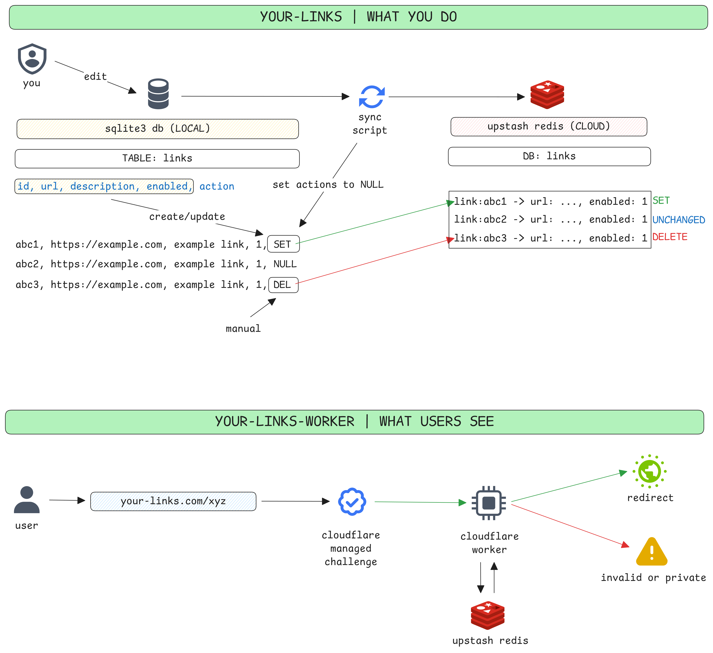

# YOUR LINKS WORKER

This is the "**WHAT USERS SEE**" part repo.
Refer "**WHAT YOU DO**" part repo at https://github.com/dwaidatta/your-links

---

Your own custom link service!

Store your links and corresponding URLs. Share as custom links. Enable or disable when needed. Change the underlying URLs without breaking your shared link.

---

## Workflow Diagram



---

## Setting Up

This setup is for "**WHAT USERS SEE**" part.

### Checks

- [x] Completed https://github.com/dwaidatta/your-links part
- [x] Node.js 18+ installed
- [x] Wragler CLI installed
- [x] [Upstash](https://upstash.com/) account
- [x] [Cloudflare](https://cloudflare.com) account

*Note: You may use different services and can change the code as per requirements.*

### Commands to Run

Kindly run the equivalent commands for different systems. Those given here are mainly for Windows and Bash.

- Clone the repo and go to the project folder

#### Setting up environment

- Create a `.env` file
- Get the tokens from Upstash (The **read-only** token)
- The `.env` file will look like:

```text
UPSTASH_REDIS_REST_URL="..."
UPSTASH_REDIS_REST_TOKEN="..."
```

### Editing required files

- Open `wrangler.toml`
It should look like:

```text
name = "your-links-worker"
compatibility_date = "YYYY-MM-DD"
main = "src/index.js"
```

- Change `YYYY-MM-DD` to current date

- Open `src/index.js`
Find this part:

```js
    // CUSTOMISE THE VALIDATION AS PER YOUR REQUIREMENTS

    if (!id || id.length < 3 || !/^[a-zA-Z0-9_-]+$/.test(id)) {
      message = "Invalid link";
      statusCode = 400;
    }
```

- Change the validation if you want or keep as it as

#### Installing dependencies and local deployment

```bash
npm install
npm run dev
```

Test that your application in localhost. If everything is good, move to deployment.

### Deploying Cloudflare Worker

*Note: You may use other services. You can customise the code as per your needs.*

- Upload your files to a GitHub repo
- Open Cloudflare Workers and select the same repo for deployment
- Add secrets from `.env` file in the deployment settings.
- After successful deployment, your worker should be available at `<worker-name>.<account-name>.workers.dev`
- Add custom domain or routing if you want. You can also disable the worker link
- Add security rules / rate limiting / cloudflare-turnstile as you like.

Your links should work in `<worker-name>.<account-name>.workers.dev/link-name`, `<your-domain>.com/link-name` or `<subdomain>.<your-domain>.com/link-name` as you set up!
